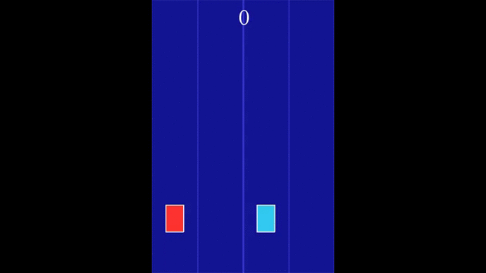

# 2-Cars
This is a game I made in python using pygame. It is very similar to the android game 2 Cars.

## How To Play
Press Space to start the game.  
Use the left arrow key to toggle the left car between lanes 1 and 2.  
Use the right arrow key to toggle the right car betwen lanes 3 and 4.  

## Rules 
Avoid all the squares and take all the circles in all the lanes using both the cars as the speed progressively increases.    
Score is equal to the number of circles you take.  
